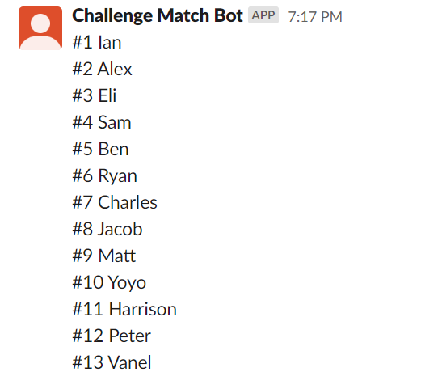

## Squash Slack Bot

Currently this is only set to run locally but will hopefully be hosted and funded by the Northeastern Squash Team

# How to run locally:

- On your terminal enter into the correct folder of this repo
- Run the following (dependencies):

```
export GO111MODULE="on"
go mod tidy
```

- Then you can run the bot (assuming sql server is set up):

```
go run main.go
```

# What can this bot do?

- This bot display the current ladder sorted of the team like so:

```
@ChallengeMatchBot ladder
```



- This bot can also update the ladder of challenge matches:

```
@ChallengeMatchBot match <player1> beats <player2>
```


- This bot can fetch all the players previous matches played:

```
@ChallengeMatchBot last matches <playerName>

This currently has a time bug reading from sql
```
